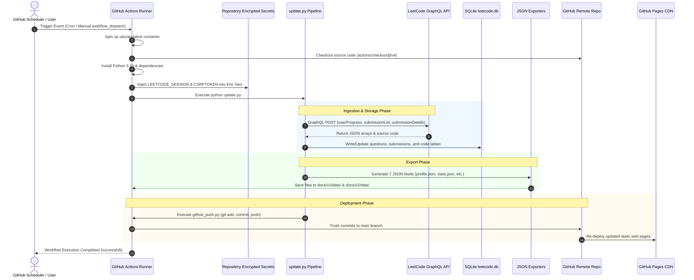

# 🤖 GitHub Actions Workflow & CI/CD Technical Documentation
## Automated Synchronization, Export, and Deployment Engine

---

## 📌 Implementation Status

> [!IMPORTANT]
> **Implementation State**: ✅ **FULLY IMPLEMENTED IN CODEBASE**
> 
> The GitHub Actions workflow and automated CI/CD pipeline infrastructure are **fully written, configured, and integrated** into this codebase. All workflow files, environment bindings, and git automation scripts are active and ready for automated cloud execution.

### Implementation Checklist

| Component | Status | Location / Details |
| :--- | :---: | :--- |
| **Workflow YAML File** | ✅ **Implemented** | [`.github/workflows/daily_sync.yml`](file:///.github/workflows/daily_sync.yml) |
| **Master Update Script** | ✅ **Implemented** | [`update.py`](file:///update.py) |
| **Automated Git Push Engine** | ✅ **Implemented** | [`github_push.py`](file:///github_push.py) |
| **Environment Variable Binding** | ✅ **Implemented** | [`config.py`](file:///config.py) |
| **Encrypted GitHub Secrets** | ⚠️ **Action Required** | Must be added once in your GitHub Repository Settings (see [Section 7](#7-how-to-setup-and-activate-github-actions)) |
| **Workflow Write Permissions** | ⚠️ **Action Required** | Must enable "Read and write permissions" in GitHub Actions Settings |

---

## 1. Overview & Purpose

In the **LeetCode Journey & Automated Analytics Engine**, maintaining an up-to-date dashboard requires continuously fetching fresh question metadata, submission logs, and source code from LeetCode. Running this update pipeline (`update.py`) manually on a local machine is inefficient and prone to missed days.

To achieve **100% automated, zero-maintenance, serverless execution**, the project utilizes **GitHub Actions**. 

### Why GitHub Actions is Used:
1. **Headless Execution**: Automates `update.py` on a cloud container without requiring a personal computer to remain powered on.
2. **Zero Infrastructure Cost**: Uses GitHub's free-tier Ubuntu runners (`ubuntu-latest`) without requiring paid Cloud VMs (like AWS EC2, DigitalOcean, or Heroku).
3. **Scheduled Synchronization**: Runs daily at midnight UTC via Cron schedules (`0 0 * * *`).
4. **On-Demand Execution**: Supports manual one-click trigger (`workflow_dispatch`) directly from the GitHub repository UI.
5. **Seamless Continuous Deployment (CD)**: Automatically commits updated database files (`output/leetcode.db`), solution source code (`output/solutions/`), and static JSON feeds (`docs/v1/data/`, `docs/v2/data/`) back to the repository, instantly updating the live GitHub Pages website.

---

## 2. Architecture & Execution Workflow

The GitHub Actions workflow integrates the entire data processing pipeline into a cloud automation cycle.

```mermaid
flowchart TD
    subgraph Trigger Mechanisms
        CRON[Cron Timer Trigger: Daily at 00:00 UTC]
        MANUAL[Manual UI Trigger: workflow_dispatch]
    end

    subgraph GitHub Runner Container (ubuntu-latest)
        STEP1[1. Checkout Repository: actions/checkout@v4]
        STEP2[2. Setup Python 3.10 Environment: actions/setup-python@v5]
        STEP3[3. Install Dependencies: pip install -r requirements.txt]
        STEP4[4. Load Encrypted Secrets: LEETCODE_SESSION, CSRFTOKEN]
        STEP5[5. Execute Pipeline: python update.py]
    end

    subgraph Python Pipeline Sub-Systems (Inside Container)
        SYNC[Sync Stage: Fetch LeetCode GraphQL API]
        DB[(Update Local Database: leetcode.db)]
        EXPORT[Export Stage: Generate Static JSON Files]
        PUSH[Git Push Stage: Commit & Push to Main Branch]
    end

    subgraph Remote Deployment Target
        REPO[GitHub Remote Repository main branch]
        PAGES[GitHub Pages CDN Hosting Live Dashboard]
    end

    CRON & MANUAL --> STEP1
    STEP1 --> STEP2 --> STEP3 --> STEP4 --> STEP5
    STEP5 --> SYNC --> DB --> EXPORT --> PUSH
    PUSH -->|git push origin main| REPO
    REPO -->|Automatic Deployment| PAGES
```

---

## 3. Workflow Sequence Diagram



---

## 4. Complete Workflow File Specification

The GitHub Action workflow is defined in `.github/workflows/daily_sync.yml`:

```yaml
name: Automated Daily LeetCode Sync & Export

on:
  schedule:
    # Runs daily at 00:00 UTC (5:30 AM IST)
    - cron: '0 0 * * *'
  workflow_dispatch: # Allows manual trigger from GitHub Actions UI

permissions:
  contents: write # Grants permissions to commit and push updated data back to repository

jobs:
  sync-and-deploy:
    runs-on: ubuntu-latest

    steps:
      - name: 1. Checkout Repository
        uses: actions/checkout@v4
        with:
          fetch-depth: 0

      - name: 2. Set up Python 3.10
        uses: actions/setup-python@v5
        with:
          python-version: '3.10'
          cache: 'pip'

      - name: 3. Install Python Dependencies
        run: |
          python -m pip install --upgrade pip
          pip install -r requirements.txt

      - name: 4. Configure Git User Credentials
        run: |
          git config --global user.name "github-actions[bot]"
          git config --global user.email "github-actions[bot]@users.noreply.github.com"

      - name: 5. Execute End-to-End Update Pipeline
        env:
          LEETCODE_SESSION: ${{ secrets.LEETCODE_SESSION }}
          CSRFTOKEN: ${{ secrets.CSRFTOKEN }}
          LEETCODE_USERNAME: ${{ secrets.LEETCODE_USERNAME }}
          DATABASE: "output/leetcode.db"
          PAGE_SIZE: 50
          REQUEST_TIMEOUT: 30
          RETRY_COUNT: 3
        run: |
          python update.py
```

---

## 5. Line-by-Line & Section Breakdown of `daily_sync.yml`

### 5.1 High-Level Summary
This YAML file tells GitHub to spin up a temporary cloud runner (virtual machine) every day at **00:00 UTC (5:30 AM IST)**, install Python, inject your LeetCode secret cookies, run `python update.py`, and push the updated database and JSON files back to your GitHub repository automatically.

---

### 5.2 Detailed Section Breakdown

#### 1. Workflow Name (Line 1)
```yaml
name: Automated Daily LeetCode Sync & Export
```
- **What it does**: Defines the human-readable title shown in the **Actions** tab on your GitHub repository page.

#### 2. Triggers (`on:`) (Lines 3–7)
```yaml
on:
  schedule:
    # Runs daily at 00:00 UTC (5:30 AM IST)
    - cron: '0 0 * * *'
  workflow_dispatch: # Allows manual trigger from GitHub Actions UI
```
- **`schedule.cron: '0 0 * * *'`**: Uses standard 5-field Cron syntax `(minute hour day month day-of-week)`. Fires automatically once every day at 00:00 UTC.
- **`workflow_dispatch`**: Adds a **"Run workflow"** button in GitHub's web interface so you can trigger an update manually anytime with one click.

#### 3. Permissions (Lines 9–10)
```yaml
permissions:
  contents: write
```
- **`contents: write`**: Grants the GitHub Actions bot permission to modify repository files, create git commits, and execute `git push` back to the `main` branch.

#### 4. Job & Runner Environment (Lines 12–14)
```yaml
jobs:
  sync-and-deploy:
    runs-on: ubuntu-latest
```
- **`sync-and-deploy`**: The unique identifier for this set of tasks.
- **`runs-on: ubuntu-latest`**: Tells GitHub to provision a fresh, clean Ubuntu Linux virtual machine runner to execute the job steps.

#### 5. Step 1 — Checkout Repository (Lines 17–20)
```yaml
- name: 1. Checkout Repository
  uses: actions/checkout@v4
  with:
    fetch-depth: 0
```
- **What it does**: Clones your repository source code into the virtual machine.
- **`fetch-depth: 0`**: Fetches full commit history, allowing Git to commit and push changes back seamlessly without shallow history errors.

#### 6. Step 2 — Setup Python 3.10 (Lines 22–26)
```yaml
- name: 2. Set up Python 3.10
  uses: actions/setup-python@v5
  with:
    python-version: '3.10'
    cache: 'pip'
```
- **What it does**: Installs Python 3.10 on the container.
- **`cache: 'pip'`**: Caches downloaded Python packages to speed up future workflow runs.

#### 7. Step 3 — Install Dependencies (Lines 28–31)
```yaml
- name: 3. Install Python Dependencies
  run: |
    python -m pip install --upgrade pip
    pip install -r requirements.txt
```
- **What it does**: Upgrades `pip` and installs required packages (`requests`, `python-dotenv`) from `requirements.txt`.

#### 8. Step 4 — Configure Git Identity (Lines 33–36)
```yaml
- name: 4. Configure Git User Credentials
  run: |
    git config --global user.name "github-actions[bot]"
    git config --global user.email "github-actions[bot]@users.noreply.github.com"
```
- **What it does**: Configures the local Git environment on the runner with official GitHub Bot credentials so `github_push.py` can create valid git commits.

#### 9. Step 5 — Execute Update Pipeline (Lines 38–48)
```yaml
- name: 5. Execute End-to-End Update Pipeline
  env:
    LEETCODE_SESSION: ${{ secrets.LEETCODE_SESSION }}
    CSRFTOKEN: ${{ secrets.CSRFTOKEN }}
    LEETCODE_USERNAME: ${{ secrets.LEETCODE_USERNAME }}
    DATABASE: "output/leetcode.db"
    PAGE_SIZE: 50
    REQUEST_TIMEOUT: 30
    RETRY_COUNT: 3
  run: |
    python update.py
```
- **`env`**: Injects your encrypted repository secrets (`LEETCODE_SESSION`, `CSRFTOKEN`, `LEETCODE_USERNAME`) into environment variables read by `config.py`.
- **`run: python update.py`**: Executes the master python script, which sequentially runs:
  1. `Exporter.sync()` (Fetches LeetCode progress, submission list, and source code into SQLite database).
  2. `JSONExporter.export()` (Re-generates all 7 static JSON feeds for the web dashboard).
  3. `GitHubPush.push()` (Executes `git add .`, `git commit`, and `git push origin main`).

---

### 5.3 Quick Directive Reference Table

| Key / Directive | Value / Command | Technical Purpose |
| :--- | :--- | :--- |
| `name` | `Automated Daily LeetCode Sync & Export` | Display name of the workflow shown in GitHub's "Actions" UI tab. |
| `on.schedule.cron` | `'0 0 * * *'` | Standard 5-field Cron syntax specifying execution at 00:00 UTC every day. |
| `on.workflow_dispatch` | `{}` | Enables an interactive "Run workflow" button in the GitHub repository web interface. |
| `permissions.contents` | `write` | Elevates the default `GITHUB_TOKEN` permissions allowing automated `git push` back to `main`. |
| `jobs.sync-and-deploy` | Job ID | Grouping of steps executed sequentially on a single virtual machine runner. |
| `runs-on` | `ubuntu-latest` | Virtual machine host environment provisioned by GitHub Actions (Ubuntu 22.04 LTS). |
| `actions/checkout@v4` | Action Plugin | Fetches full repository history (`fetch-depth: 0`) so Git commits can be made locally. |
| `actions/setup-python@v5` | Action Plugin | Installs Python 3.10 runtime environment and configures `pip` package caching. |
| `Install Dependencies` | `pip install -r requirements.txt` | Installs `requests` and `python-dotenv` packages required by `update.py`. |
| `Configure Git User` | `git config --global user.name ...` | Configures standard GitHub Bot committer identity (`github-actions[bot]`). |
| `env` | `${{ secrets.* }}` | Securely maps GitHub repository encrypted secrets into container environment variables. |
| `run` | `python update.py` | Triggers master python script executing Sync -> Export -> Git Push. |

---

## 6. Secret Management & Security Isolation

To query LeetCode's private GraphQL endpoint headlessly, the pipeline requires valid authentication cookies (`LEETCODE_SESSION` and `csrftoken`). Storing credentials in public source code is a high security risk.

### How GitHub Actions Protects Credentials:

1. **Encrypted Repository Secrets**: Credentials are encrypted at rest using libsodium and saved in GitHub repository settings:
   - `LEETCODE_SESSION`: Session cookie string.
   - `CSRFTOKEN`: Cross-Site Request Forgery security token.
   - `LEETCODE_USERNAME`: Target LeetCode profile username.

2. **Environment Variable Injection**:
   In the workflow file, secrets are mapped directly into environment variables read by `config.py`:
   ```yaml
   env:
     LEETCODE_SESSION: ${{ secrets.LEETCODE_SESSION }}
     CSRFTOKEN: ${{ secrets.CSRFTOKEN }}
     LEETCODE_USERNAME: ${{ secrets.LEETCODE_USERNAME }}
   ```

3. **Runtime Protection**:
   `config.py` uses `os.getenv("LEETCODE_SESSION")` to extract credentials seamlessly whether running locally or inside GitHub Actions. GitHub Actions automatically masks secret values in console execution logs (`***`).

---

## 7. How to Setup and Activate GitHub Actions

Follow these simple steps to activate the implemented workflow on your GitHub repository:

> [!NOTE]
> The workflow code (`.github/workflows/daily_sync.yml`) is already fully implemented in the code repository. You only need to complete the standard one-time GitHub web settings below to activate cloud runs.

### Step 1: Push Workflow File
Ensure `.github/workflows/daily_sync.yml` is committed and pushed to your GitHub repository:
```bash
git add .github/workflows/daily_sync.yml
git commit -m "ci: add daily sync GitHub Actions workflow"
git push origin main
```

### Step 2: Configure Secrets in GitHub
1. Open your repository on GitHub.
2. Click on **Settings** → **Secrets and variables** → **Actions**.
3. Click **New repository secret** and add the following 3 secrets:

| Secret Name | How to obtain value |
| :--- | :--- |
| `LEETCODE_SESSION` | Log into LeetCode → Press `F12` → **Application** → **Cookies** → Copy `LEETCODE_SESSION` value. |
| `CSRFTOKEN` | Log into LeetCode → Press `F12` → **Application** → **Cookies** → Copy `csrftoken` value. |
| `LEETCODE_USERNAME` | Your LeetCode username (e.g. `Shreyansh-Kumar-Singh`). |

### Step 3: Enable Repository Write Permissions
1. Go to **Settings** → **Actions** → **General**.
2. Scroll down to **Workflow permissions**.
3. Select **Read and write permissions**.
4. Check **Allow GitHub Actions to create and approve pull requests**.
5. Click **Save**.

### Step 4: Test Workflow Manually
1. Click on the **Actions** tab at the top of your GitHub repository.
2. Select **Automated Daily LeetCode Sync & Export** on the left menu.
3. Click **Run workflow** → Select branch `main` → Click **Run workflow**.

---

## 8. Implementation Summary Comparison

| Aspect | Without GitHub Actions (Manual/Local) | With Implemented GitHub Actions Workflow |
| :--- | :--- | :--- |
| **Status** | Manual execution mode | ✅ **Fully Implemented in Codebase** |
| **Automation** | Must run `python update.py` manually every day | 100% automated daily background sync |
| **Uptime Requirement**| Local computer must stay ON and connected to internet | Headless cloud execution (0% computer uptime needed) |
| **Data Integrity** | High risk of missing activity logs on offline days | Continuous daily snapshot backups in SQLite & JSON |
| **Deployment** | Requires manual `git push` to update GitHub Pages | Auto-commits and auto-deploys updated web feeds |
| **Cost** | Free (but requires personal hardware) | 100% Free (utilizes GitHub free-tier runner minutes) |
